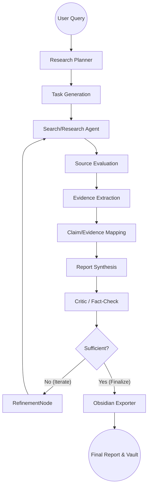

# Automated Research Synthesizer & Obsidian Exporter

This is an agentic research system built using LangGraph, FastAPI, and Streamlit. It autonomously researches a given topic, evaluates sources, extracts evidence, generates a factual report with citations, critiques its own work, and exports the final output into a set of interconnected Obsidian notes.

## Architecture

The system uses **LangGraph** as the orchestration layer to model the research process as an explicit graph.



## Running the Application

1. **Setup Environment**
   ```bash
   python -m venv venv
   .\venv\Scripts\activate
   pip install -r requirements.txt
   ```

2. **Configuration**
   Copy `.env.example` to `.env` and fill in your Azure OpenAI credentials.

3. **Start FastAPI Backend**
   ```bash
   uvicorn app.api.main:app --reload
   ```

4. **Start Streamlit Frontend**
   In a new terminal:
   ```bash
   streamlit run frontend/app.py
   ```
